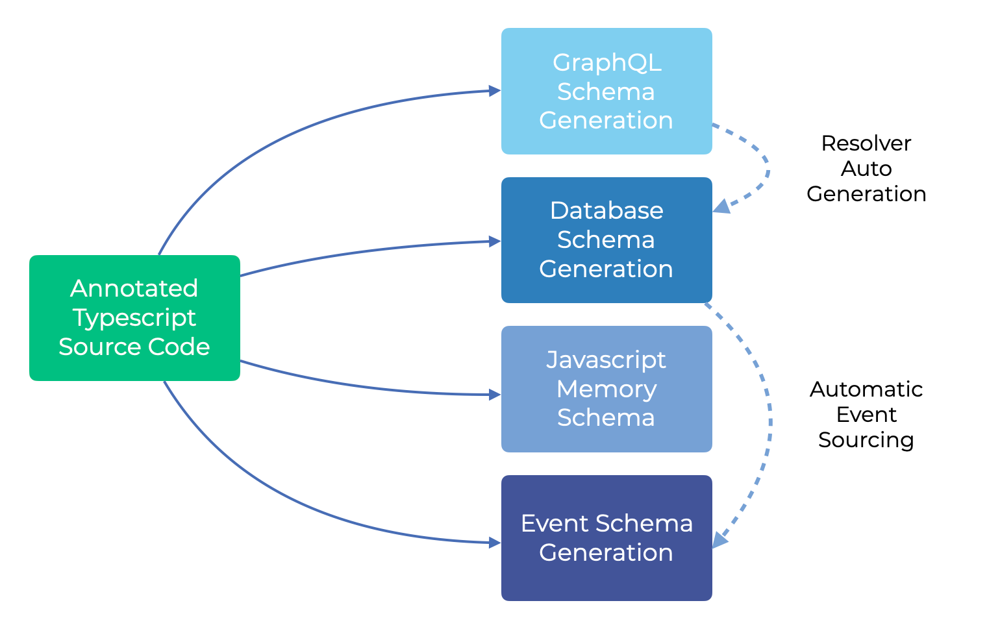

# mikro-orm-graphql-example

_One model to rule them all_

Link to the [Article](https://medium.com/@orefalo_66733/microservice-proof-of-concept-7eb951cf7ee6)



## 🏷️ Features

- Automatic GraphQL API generation
- Automatic DB Schema generation
- Automatic event generation on mutations
- Database up/down migrations
- Service auto-reload on source code change
- Support for many other database targets - MongoDB, MySQL, SQLlite..etc

## 📦 TechStack

- [GraphQL](https://graphql.org/) - A fantastic middleware tech
- [TypeGraphQL](https://typegraphql.com/) - A code to graphql schema generator
- [MikroORM](https://mikro-orm.io/) - Probably the best ORM for Typescript (support identity maps and automatic transactions)
- [Typescript](https://www.typescriptlang.org/) - A somehow decent typed language
- [Mocha](https://mochajs.org/) - An old testing framework (I tried vitest but it doesn't support reflect-metadata)
- [Ulid](https://github.com/ulid/spec) - A robust, distributed, timebased GUID
- [Apollo Server](https://www.apollographql.com/) - An good looking GrapQL server - yet a resource hog
- graphql-fields-to-relations - a graphql/database relationship optimizer (now bundled in the repo)

## ✨ Installation & Usage

The application requires `nodejs` and `docker` installed on your computer.

1. Install dependencies via `pnpm i`or `npm i`
2. Started the dockerized Postgres database via `docker-compose up -d`
3. Load fixtures `pnpm loadFixtures`, this will create the supporting schema in the database
4. Start the graphQL server via `pnpm start` (for prod) or `pnpm dev`(for dev)
5. Open a browser to [localhost:4000/graphql](http://localhost:4000/graphql)

## ⚡️ Testing

Unit tests and code coverage are fully implemented

1. `pnpm test`
2. `pnpm coverage`

## 🗂️ Migrations

MikroORM supports database migrations allow to incrementaly change the schema as features are implemented.

After developing a feature, run the following commands to create an incremental migration:

```
pnpm mikro-orm schema:drop --run
pnpm mikro-orm migration:up
pnpm mikro-orm migration:create
```

## 👤 Author

Olivier Refalo
